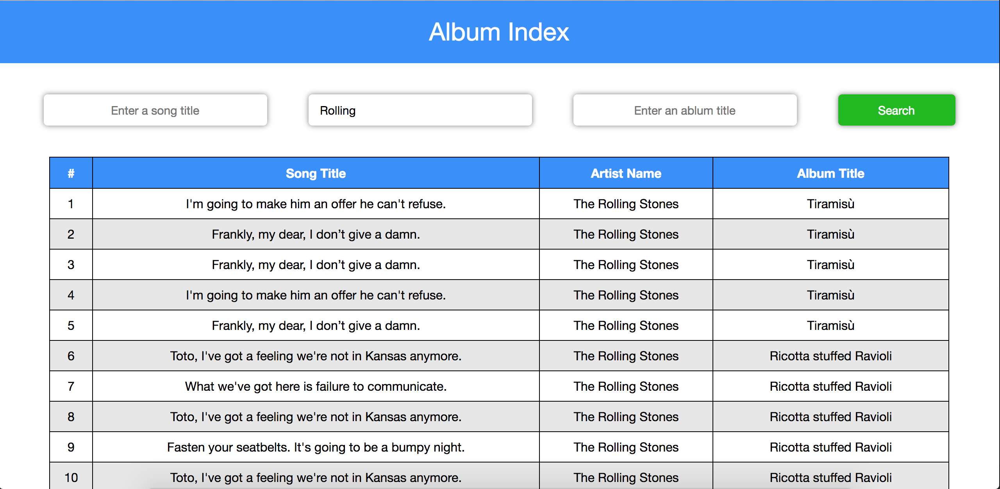

# AlbumIndex

A web application for searching a list of songs by filters of song title, artist name and album title.

Tech Stack:
- React/ES6
- Ruby on rails
- Postgresql

## Setting Up
Start postgres and run:
```
rake db:create db:migrate db:seed
```

Starting app on localhost:3000
```
npm install
bundle exec install
rake db:see
rails s
webpack -w
```



## Database Schema
### song
column name     | data type | details
----------------|-----------|-----------------------
id              | integer   | not null, primary key
title           | string    | not null, indexed
artist_id       | integer   | not null, foreign key
album_id        | integer   | foreign key

### artist
column name     | data type | details
----------------|-----------|-----------------------
id              | integer   | not null, primary key
name            | string    | not null, indexed

### album
column name     | data type | details
----------------|-----------|-----------------------
id              | integer   | not null, primary key
title           | string    | not null, indexed
